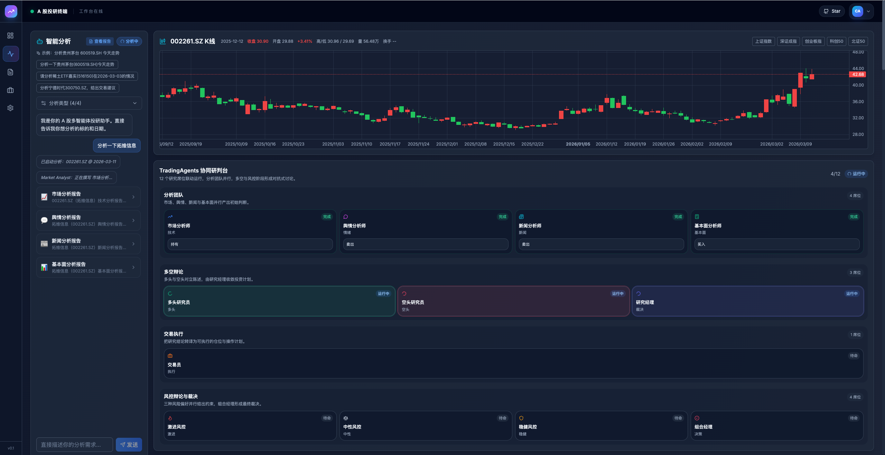
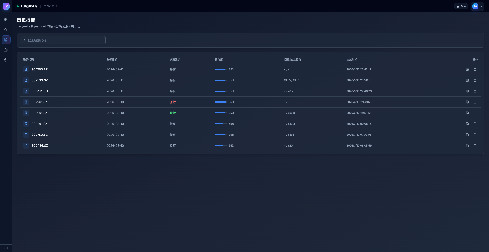
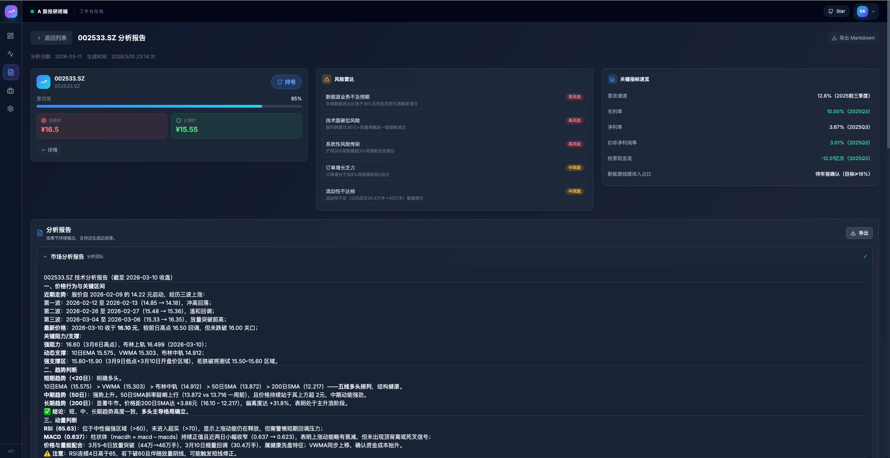
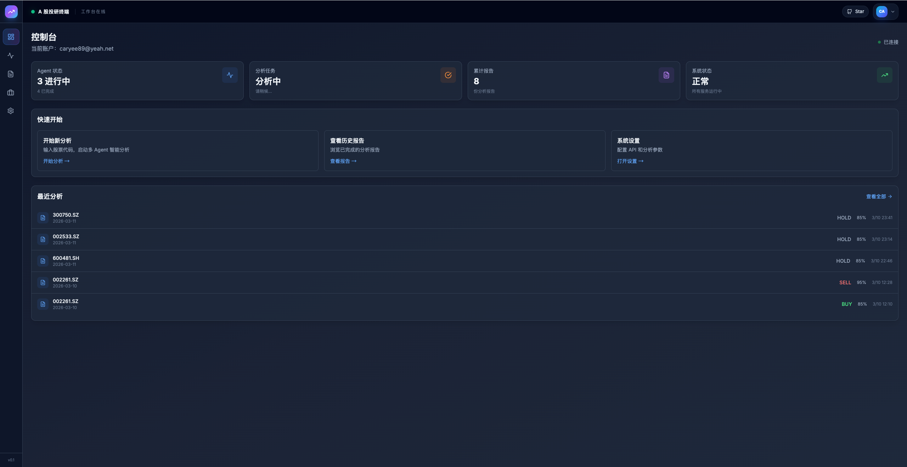
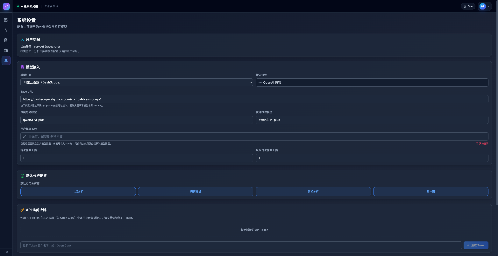

# TradingAgents-AShare：A股智能投研多智能体系统
**A-Share Intelligent Investment Research Terminal**

本项目是基于多智能体协作 (Multi-Agent Collaboration) 的 A 股深度分析系统。它模拟顶级投研机构的决策闭环，通过 15名专业分析师的博弈与辩论，为投资者提供结构化的交易建议。

**🚀 **TradingAgents 已正式上线 OpenClaw**！您只需通过 `tradingagents-analysis` 技能，即可让您的 AI助手具备专业的 A 股深度投研能力。**

## 🌟 核心能力 (V0.4.0+)
- **🧠 意图驱动解析**：无需精准代码，自然语言对话（如“调研茅台短线”）即可触发自动标的识别与周期视角切换。
- **📊 15 专家协作流**：集成技术面、基本面、舆情、新闻、宏观及主力资金 6 大维度，经过 5 阶段严密博弈产出研报。
- **⚡️ 极致数据效能**：统一并行采集底座，彻底解决 API 频率限制，实现分析流程的秒级启动。
- **🐳 生产级容器化**：全架构 Docker 支持，前后端合一托管，具备完善的路径安全防护与自动构建 CI。

## ✨ 现代化 Web 交互

系统已由传统的 CLI 界面全面升级为现代化的 Web 交互界面，支持实时任务进度追踪、响应式布局与结构化研报管理。
[在线 Demo](https://app.510168.xyz)

<div align="center">
  <br><em>Agent 协作分析</em>
  <table style="width: 100%">
    <tr>
      <td width="50%"><br><em>研报历史管理</em></td>
      <td width="50%"><br><em>深度分析详情</em></td>
    </tr>
    <tr>
      <td width="50%"><br><em>数据控制台</em></td>
      <td width="50%"><br><em>系统设置</em></td>
    </tr>
  </table>
</div>


## 🤖 核心架构与团队

TradingAgents 模拟了真实交易机构的部门协作，将复杂任务拆解为专业的智能体角色：

<p align="center">
  
</p>

*图中仅展示核心节点，完整流程包含 15 名智能体。

### 1. 分析师团队 (Analyst Team)
基本面、情绪、新闻、技术四大维度分析师同步作业，对市场数据进行深度提取与初步评估。
<p align="center">
  
</p>

### 2. 研究员团队 (Researcher Team)
由多头与空头研究员组成，针对分析师结论开展结构化辩论（红蓝对抗），在冲突中挖掘潜在收益并识别关键风险。
<p align="center">
  
</p>

### 3. 决策与风控 (Trader & Risk Management)
交易员根据辩论结果生成初始方案，风控团队进行流动性与波动率审查，最终由组合经理批准执行。
<p align="center">
  
</p>


## 🚀 快速上手

### 1. Docker 一键部署 (推荐)
如果您想快速运行完整服务（前后端合一），可以直接使用我们提供的 Docker 镜像：

```bash
docker pull ghcr.io/kylinmountain/tradingagents-ashare:latest

# 创建数据目录（数据库及 WAL 文件会持久化在此）
mkdir -p $(pwd)/data

docker run -d -p 8000:8000 \
  --name tradingagents \
  -v $(pwd)/data:/app/data \
  -e DATABASE_URL="sqlite:///./data/tradingagents.db" \
  -e TA_API_KEY="你的密钥" \
  -e TA_BASE_URL="https://api.openai.com/v1" \
  ghcr.io/kylinmountain/tradingagents-ashare:latest
```

> **从旧版升级？** 如果之前用的是 `-v tradingagents.db:/app/tradingagents.db` 单文件挂载，请将 db 文件移到 `data/` 目录下，改用目录挂载方式。
访问 `http://localhost:8000` 即可使用。

### 2. 源码安装

#### 2.1 环境准备
克隆项目：
```bash
git clone https://github.com/KylinMountain/TradingAgents-AShare.git
cd TradingAgents-AShare
```

安装后端（Python 3.10+，推荐使用 [uv](https://github.com/astral-sh/uv)）：
```bash
uv sync
```

安装前端（Node.js 18+）：
```bash
cd frontend && npm install
```

#### 2.2 精简配置
复制 `.env.example` 到 `.env` 并填写核心模型接入信息：
```env
# 核心模型接入 (建议使用 DeepSeek 或 GPT-4o 等强模型)
TA_API_KEY=你的密钥
TA_BASE_URL=https://api.openai.com/v1
TA_LLM_QUICK=gpt-4o-mini
TA_LLM_DEEP=gpt-4o

# 数据库 (默认使用本地 SQLite，Docker 部署建议用 data/ 子目录)
DATABASE_URL=sqlite:///./tradingagents.db
```

#### 2.3 启动运行
**启动后端 API**：
```bash
uv run python -m uvicorn api.main:app --port 8000
```

**启动前端界面**：
```bash
cd frontend && npm run dev
```
访问 `http://localhost:5173` 即可开始您的 AI 投研之旅。


## 🛠 API 集成

系统提供标准的 REST API，方便集成到自定义脚本、交易机器人或第三方看板：

1. **触发分析**：`POST /v1/analyze` -> 立即返回 `job_id`
2. **状态追踪**：`GET /v1/jobs/{job_id}` -> 轮询 `status`
3. **获取结果**：`GET /v1/jobs/{job_id}/result` -> 拿到结构化研报
4. **历史检索**：`GET /v1/reports` -> 拉取过往所有分析记录

生产环境 Base URL：

- `https://api.510168.xyz`

认证方式：

- 在 Web 端登录后，进入“设置 / API Token”生成专属 API Key
- 调用接口时通过 `Authorization: Bearer <YOUR_API_TOKEN>` 传入

示例：触发一次股票分析

```bash
curl -X POST 'https://app.510168.xyz/v1/analyze' \
  -H 'Content-Type: application/json' \
  -H 'Authorization: Bearer <YOUR_API_TOKEN>' \
  -d '{
    "symbol": "分析一下600519.SH短期趋势",
    "trade_date": "2026-03-11"
  }'
```

拿到 `job_id` 后继续查询：

```bash
curl -H 'Authorization: Bearer <YOUR_API_TOKEN>' \
  'https://app.510168.xyz/v1/jobs/<JOB_ID>'

curl -H 'Authorization: Bearer <YOUR_API_TOKEN>' \
  'https://app.510168.xyz/v1/jobs/<JOB_ID>/result'
```

## 🔌 集成 OpenClaw

可以把 TradingAgents-AShare 作为 OpenClaw 的外部分析能力来调用，让 OpenClaw 负责“接收任务 -> 指定股票 -> 发起分析 -> 回收结果 -> 继续编排后续动作”。

推荐接法：

1. 在本站生成 API Key
2. 在 OpenClaw 中安装技能`tradingagents-analysis`

一个典型任务可以是：

- “分析 002594.SZ 今天是否适合介入，给我结论、置信度、目标价、止损价和核心风险。”


## 🙏 特别鸣谢 (Credits)

本项目作为二次开发作品，核心架构灵感与部分基础逻辑源自[TauricResearch/TradingAgents](https://github.com/TauricResearch/TradingAgents)。感谢原作者及团队在多智能体交易领域做出的卓越探索与开源贡献。

## ⚖️ 许可说明
- 本项目基于 [TauricResearch/TradingAgents](https://github.com/TauricResearch/TradingAgents) (Apache 2.0) 二次开发。
- 新增模块 (`api/`, `frontend/`) 及对核心逻辑的深度修改采用 `PolyForm Noncommercial 1.0.0` 协议。
- 详情请参阅根目录下的 [LICENSE](./LICENSE) 文件。

## ⚠️ 重要声明 (Disclaimer)
- **仅供学习研究**：本项目仅用于学术研究、技术演示及学习交流目的，不构成任何形式的投资建议。
- **实盘风险**：证券市场有风险，投资需谨慎。基于本系统智能体生成的任何观点、建议或计划，仅代表算法博弈结果，不对实际投资损益负责。
- **数据延迟**：分析所依赖的数据源可能存在延迟或偏差，请以交易所实时公告为准。

<div align="center">
<a href="https://www.star-history.com/#KylinMountain/TradingAgents-AShare&Date">
 <picture>
   <source media="(prefers-color-scheme: dark)" srcset="https://api.star-history.com/svg?repos=KylinMountain/TradingAgents-AShare&type=Date&theme=dark" />
   <source media="(prefers-color-scheme: light)" srcset="https://api.star-history.com/svg?repos=KylinMountain/TradingAgents-AShare&type=Date" />
   
 </picture>
</a>
</div>

